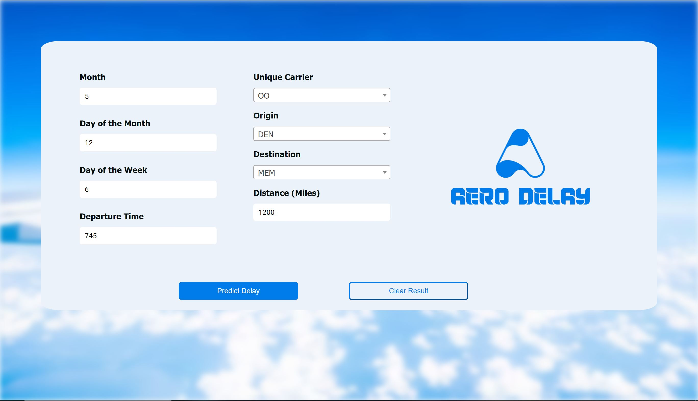

# Flight Delay Prediction App

## Overview

This web application predicts flight delays based on user input. 
Users can enter details such as month, day, time, carrier, origin, destination, and distance to get a prediction about potential delays.



## Features

- Input form for user details.
- Integration with a machine learning model for delay prediction.
- Display of prediction result on the web page.

## Tech Stack

- Flask: Web framework for Python.
- scikit-learn: Machine learning library.
- HTML/CSS: Front-end styling.
- jQuery: JavaScript library for asynchronous operations.

## Getting Started

1. Install dependencies:

    ```bash
    pip install -r requirements.txt
    ```

1. Set the Flask app:

    ```bash
    set FLASK_APP=Aerodelay_app
    ```


2. Run the Flask app:

    ```bash
    python -m flask run
    ```

3. Open the app in your browser: [http://localhost:5000](http://localhost:5000)

## Project Structure

- `Aerodelay_1.0`: Main Flask application.
- `model/`: Machine learning model implementation.
- `static/`: Static files (CSS, images, etc.).
- `templates/`: HTML templates.

## References

- Dataset used : https://www.kaggle.com/code/altprof/basic-semi-supervised-learning-models/notebook


